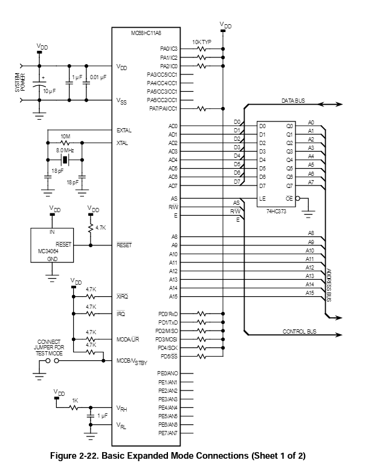
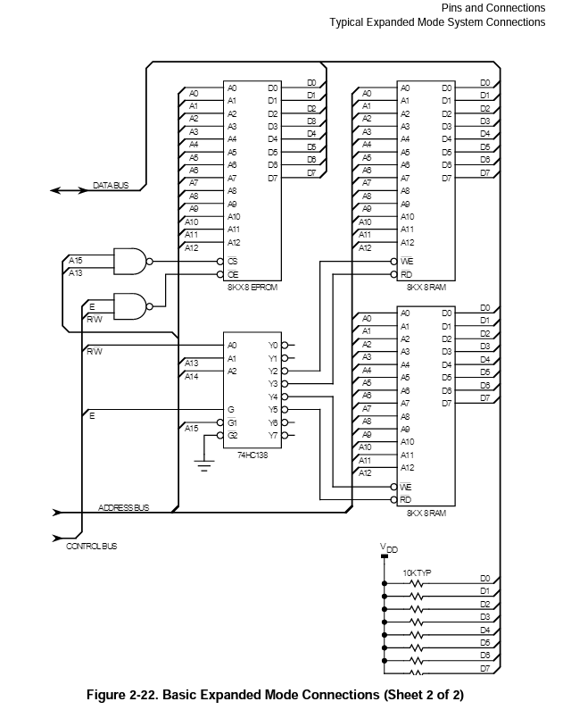
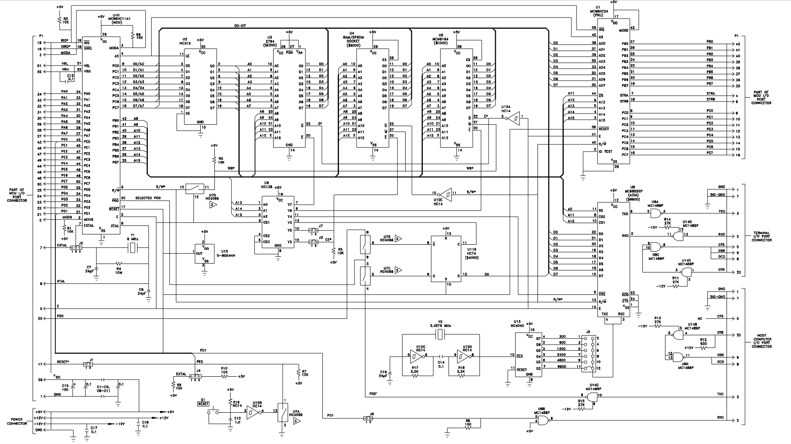

# MEZ68H11E 設計メモ

## コンセプト

* 外部RAM+外部シリアルポートで立ち上げる。
* 内蔵シリアルポートでの使用に切り替える。
* Expanded Modeで動作。
* リセットはPICから掛ける、PIC側もオープンドレインとする。
* クロックはPICから与える。EXTAL端子に入力する。
* ブートローディングはRESET中に行う。MPUのA/D/E/RWすべてHi-Zとなるので、PICからSRAMに直接読み書きできる。
* シングルステップ実現: 

## 対象チップ

MC68HC11E1CFN2: 買ったものの刻印がこれだった。

* RAM 512byte: 0000-00FF
* EEPROM: 512byte: B600-B7FF
* ROM/EPROMなし
* Clock Max 2MHz

## ピンアサイン

MC68H11E 52-Pin PLCC MC68HC11E1CFN2

|No|Name|This app|Desription|
|--|--|--|--|
1|Vss|Vss|5V印可。
2|MODB/Vstby|MODB|10kohmプルアップ
3|MODA/LIR|MODA|10kohmプルアップ
4|STRA/AS|AS|HC373ラッチのG信号として
5|E|E|PICに与える。Z80-MREQ
6|STRB/R/W|R/W|PICに与える。Z80-RD
7|EXTAL|EXTAL|PICからクロックを与える。
8|XTAL||10kohmプルダウン
9|PC0/ADDR0/DATA0|AD0|HC373ラッチD入力。かつ、D0-7にもつなげる　　　　　　　　　　　　　　　　　　　　　　　　　　　　　　　　　　　　　　　　　　　　　　　　　　　　　　　　　　　　　　　　　　　　　　　　　　　　　　　　　　　　　　　　　　　　　　　　　　　　　　　　
10|PC1/ADDR1/DATA1|AD1|HC373ラッチD入力。かつ、D0-7にもつなげる　　　　　　　　　　　　　　　　　　　　　　　　　　　　　　　　　　　　　　　　　　　　　　　　　　　　　　　　　　　　　　　　　　　　　　　　　　　　　　　　　　　　　　　　　　　　　　　　　　　　　　　　
11|PC2/ADDR2/DATA2|AD2|HC373ラッチD入力。かつ、D0-7にもつなげる　　　　　　　　　　　　　　　　　　　　　　　　　　　　　　　　　　　　　　　　　　　　　　　　　　　　　　　　　　　　　　　　　　　　　　　　　　　　　　　　　　　　　　　　　　　　　　　　　　　　　　　　
12|PC3/ADDR3/DATA3|AD3|HC373ラッチD入力。かつ、D0-7にもつなげる　　　　　　　　　　　　　　　　　　　　　　　　　　　　　　　　　　　　　　　　　　　　　　　　　　　　　　　　　　　　　　　　　　　　　　　　　　　　　　　　　　　　　　　　　　　　　　　　　　　　　　　　
13|PC4/ADDR4/DATA4|AD4|HC373ラッチD入力。かつ、D0-7にもつなげる　　　　　　　　　　　　　　　　　　　　　　　　　　　　　　　　　　　　　　　　　　　　　　　　　　　　　　　　　　　　　　　　　　　　　　　　　　　　　　　　　　　　　　　　　　　　　　　　　　　　　　　　
14|PC5/ADDR5/DATA5|AD5|HC373ラッチD入力。かつ、D0-7にもつなげる　　　　　　　　　　　　　　　　　　　　　　　　　　　　　　　　　　　　　　　　　　　　　　　　　　　　　　　　　　　　　　　　　　　　　　　　　　　　　　　　　　　　　　　　　　　　　　　　　　　　　　　　
15|PC6/ADDR6/DATA6|AD6|HC373ラッチD入力。かつ、D0-7にもつなげる　　　　　　　　　　　　　　　　　　　　　　　　　　　　　　　　　　　　　　　　　　　　　　　　　　　　　　　　　　　　　　　　　　　　　　　　　　　　　　　　　　　　　　　　　　　　　　　　　　　　　　　　
16|PC7/ADDR7/DATA7|AD7|HC373ラッチD入力。かつ、D0-7にもつなげる　　　　　　　　　　　　　　　　　　　　　　　　　　　　　　　　　　　　　　　　　　　　　　　　　　　　　　　　　　　　　　　　　　　　　　　　　　　　　　　　　　　　　　　　　　　　　　　　　　　　　　　　
17|RESET|RESET|2N7000オープンドレインで駆動。電源ON時に FET SW ON(10kプルアップ)、PIC未動作時に 確実にリセットが掛かるようにする。
18|XIRQ/Vppe|XIRQ|シングルステップで使用する。ソフト最初に CCRレジスタのXビットをセットしないと 動作しない。
19|IRQ|IRQ|10kohm プルアップにしておく
20|PD0/RxD|RxD|10kohm プルアップにしておく 将来的にシリアル端子として使う
21|PD1/TxD|TxD|10kohm プルアップにしておく。 将来的にシリアル端子として使う
22|PD2/MISO|PD2|10kohm プルアップにしておく
23|PD3/MOSI|PD3|10kohm プルアップにしておく
24|PD4/SCK|PD4|10kohm プルアップにしておく
25|PD5/SS|PD5|10kohm プルアップにしておく
26|Vdd|Vdd|5V電源。
27|PA7/PA1/OC1||10kohmプルアップ
28|PA6/OC2/OC1||接続無し
29|PA5/OC3/OC1||接続無し
30|PA4/OC4/OC1||接続無し
31|PA3/OC5/IC4/OC1||接続無し
32|PA2/IC1||10kohmプルアップ
33|PA1/IC2||10kohmプルアップ
34|PA0/IC3||10kohmプルアップ
35|PB7/ADDR15|A15
36|PB6/ADDR14|A14
37|PB5/ADDR13|A13
38|PB4/ADDR12|A12
39|PB3/ADDR11|A11
40|PB2/ADDR10|A10
41|PB1/ADDR9|A9
42|PB0/ADDR8|A8
43|PE0/AN0||接続無し
44|PE4/AN4||接続無し
45|PE1/AN1||接続無し
46|PE5/AN5||接続無し
47|PE2/AN2||接続無し
48|PE6/AN6||接続無し
49|PE3/AN3||接続無し
50|PE7/AN7||接続無し
51|Vrl||AD変換の－基準側、GNDでよい
52|Vrh||AD変換の＋基準側、Vccでよい。Vrl-Vrh間に 0.1uFパスコン入れておくこと。

## クロック

* EXTALに外部から注入する。max 2MHzなので、EXTALクロックの最大値は8MHzである。
* Eクロックはこの入力の1/4である。
* EXTALに外部クロックを入れるときはXTALはleft unterminatedでよいが、EFI対策のため、10-100kohmでプルダウンしておくとよい。

## リセット

* FETオープンドレインで駆動する。PIC側(FETゲート入力)は10kプルアップ。
* リセット信号自体は10kプルアップ。
* リセット中はMODA/LIAピンをHにする。リセット解除後、MODA/LIAピンをHigh-Z(PIC側で入力)とする(Page47)。
* MODBピンもHにしておく。

### リセット状態のMPUの挙動

> During reset, internal logic in the MC68HC11A8 forces all DDR bits to 0; thus, all bidirectional I/O pins are configured as high-impedance inputs until they are reconfigured by software.

> リセット中、MC68HC11A8の内部ロジックは、すべてのDDRビットを強制的に0にします。したがって、すべての双方向I/Oピンは、ソフトウェアによって再設定されるまで、ハイインピーダンス入力として構成されます。

とあるので、リセット中はHi-Zになりそう。通常のブートローディングが使える。

### expanded modeにおけるPortB PortCのRead/Write

> When the MC68HC11A8 is operating in an expanded mode, reads and 
writes to the port B address are treated as external accesses to allow 
port B functions to be emulated with external logic. The MC68HC24 port 
replacement unit (PRU) duplicates the general-purpose and handshake 
I/O functions of ports B and C and the STRA and STRB pins. The 
MC68HC24 connects to the multiplexed address/data bus of the 
MC68HC11A8.

外部ロジックによりPortBエミュレーションができるように外部アクセスする。これを
使うと外部ポートをエミュレートできる。

## 外部RAM

* 74HC373でアドレス信号16本とデータ信号8本を取る。
* CS, WR, OE: PICのCLCで生成する。アドレス上位3ビットとE,R/Wから。
* アドレスデコード上位3ビット行うために、A14,A15が必要。EMUPU_RAM40を使う場合RFSH,WAIT信号にA14,A15を繋ぐ。これでPD6,7にA14,A15が入りいい感じになる。

## シリアルポート

* PIC側のシリアルポートで立ち上げる。まずはデバッグシリアルとして。

## シングルステップ

* シングルステップ機能を実現する。
* XIRQで都度割り込みを掛けてレジスタをダンプさせる。
* リセット直後はXビットがセットされている(XIRQ disable)なので、最初に命令置きでXビットをリセットする。スタックをセットしてからXビットをクリアする。

> Immediately after any reset, the X bit is set; thus, XIRQ is inhibited. 

## 回路図

### リファレンスマニュアルの参照回路図

<figure style="text-align: center">

</figure>

### 評価ボード MC68HC11EVBの回路図

<figure style="text-align: center">

</figure>

* Expanded Mode/ MODA, MODBとも10kプルアップ。
* クロック: 8MHz水晶。EXTALにジャンパで外部クロック注入可能。
* 外部ROM/RAM: HC138でアドレスセレクタ。E == 0 の時のみROM/RAMのWR信号がLになるようにしている(4066アナログスイッチ)。
* ROM: 2764, E000-FFFFの8kB専有
* RAM/EPROM: 28pinタイプ、6000-7FFFかA000-BFFFかをジャンパで選択できる。
* MCM6164: 8k x 8bit SRAM、C000-DFFFの8KB専有。
* MC68HC24: PRU(Port Replacement Unit), 68HC11をExpanded Modeで使うときのPortC/PortD代替チップ。MC68HC11 Reference Manualに簡単な説明がある。
* MC68B50: ACIA、シリアルポート。8000-9FFFが/CS2, A11,A12がCS0,CS1に入っている。9800-9801が想定アドレスかな。TxD, RxDのみが外とつながっている。
* ACIA用クロック: 2.4576MHzをMC4040で分周して68B50のTXC/RXCに与えている。ジャンパで300bps-9600bpsまでを選択できる。
* 直結シリアル: PD0(20)/PD1(21)をシリアルポートとして使うかどうかをジャンパとソフトで決められる。$4000番地に00を書き込むと外部端子、01を書き込むとホストコンピュータ用I/O ポート側につながる。